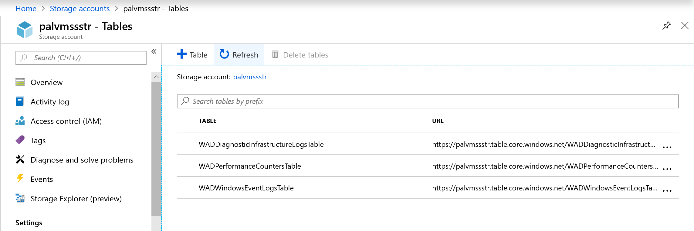

# vmss diagnostics extension
describes how azure diagnostics can be enabled on a Virtual Machine Scale Set. The first part covers the steps to enable this for a VMSS running Windows VMs. The steps to enable these for a VMSS running Linux VMs to follow soon.

## Using Azure CLI - Windows VM based Scale Sets
These steps can be performed on an existing Virtual Machine Scale Set running Windows VMs. In the example here, a VMSS with the following properties pre-exist in Azure before enabling the Diagnostics extension.

VMSS Name - *palvmss*

VMSS Resource Group Name: *palvmssrg*

### Pre-requisites:
- Azure CLI on the local Computer. Details on this [here](https://docs.microsoft.com/en-us/cli/azure/install-azure-cli?view=azure-cli-latest)

The CLI Command to enable the extension is documented [here](https://docs.microsoft.com/en-us/cli/azure/vmss/diagnostics?view=azure-cli-latest#az-vmss-diagnostics-set)

### Create a Storage Account to store the Diagnostics from the Scale Set
A Storage Account with the name palvmssstr is created in Azure

### Create the Protected and Public Configuration Settings for the Diagnostics Extension

#### Public Settings Configuration
The Storage Account name needs to be entered in this Json Document. Save this file to the Working folder on your Computer (*PublicSettings.json*).

````
{
    "WadCfg": {
        "DiagnosticMonitorConfiguration": {
            "overallQuotaInMB": 10000,
            "DiagnosticInfrastructureLogs": {
                "scheduledTransferLogLevelFilter": "Verbose"
            },
            "PerformanceCounters": {
                "scheduledTransferPeriod": "PT1M",
                "sinks": "AzureMonitorSink",
                "PerformanceCounterConfiguration": [
                    {
                        "counterSpecifier": "\\Processor(_Total)\\% Processor Time",
                        "sampleRate": "PT1M",
                        "unit": "percent"
                    },
                    {
                        "counterSpecifier":"\\Memory\\Available Bytes",
                        "sampleRate":"PT15S",
                        "unit": "Bytes"
                    }
                ]
            },
            "WindowsEventLog": {
                "scheduledTransferPeriod": "PT1M",
                "DataSource": [
                    {
                        "name": "Application!*[System[(Level=1 or Level=2 or Level=3)]]"
                    },
                    {
                        "name": "System!*[System[(Level=1 or Level=2 or Level=3)]]"
                    },
                    {
                        "name": "Security!*[System[(band(Keywords,4503599627370496))]]"
                    }
                ]
            },
            "Logs": {
                "scheduledTransferPeriod": "PT1M",
                "scheduledTransferLogLevelFilter": "Verbose"
            }
        },
        "SinksConfig": {
            "Sink": [
                {
                    "name": "AzureMonitorSink",
                    "AzureMonitor":
                    {
                       
                    }
                }]
        }
    },
    "StorageAccount": "palvmssstr",
    "StorageType": "TableAndBlob"
}
````
Add other Performance counters and metrics to the configuration above, as necessary. Shown in this example are just a few of them. More details on these [here](https://docs.microsoft.com/en-us/azure/azure-monitor/platform/diagnostics-extension-schema-1dot3). The *PublicConfig.xml* file in this repo has other Performance counters that can be used.

### Protected Settings Configuration
This configuration contains the keys to access the Storage Account. Generate a SAS Key for the Storage Account, from the Azure portal. The '?' preceding the SAS key has to be removed before use. Save this Json document to the working folder on the local Computer(*PrivateSettings.json*)

````
{
    "storageAccountName": "palvmssstr",
    "storageAccountKey": "<Access Key to the Storage Account>",
    "storageAccountEndPoint": "https://core.windows.net",
    "storageAccountSasToken": "sv=2018-03-28&ss=bfqt&srt=sco&sp=rwdlacup&se=2019-06-29T13:57:55Z&st=2018-12-15T05:57:55Z&spr=https&sig=<generate a SAS Key from the Storage Account>"
}
````
### Run the CLI Command
````
az vmss diagnostics set --resource-group palvmssrg  --settings PublicSettings.json   --vmss-name palvmss --no-auto-upgrade --protected-settings PrivateSettings.json 
````
This step takes a couple of minutes to complete After this runs successfully, verify that the diagnostics data is generated, by navigating to the Storage Account, and viewing the Storage Tables - see figure below



Use the Azure Storage Emulator to connect to the Storage Table and view the Diagnostics data generated by the extension.

## Using Powershell - Windows VM based Scale Sets
Enabling the diagnostics extension can also be performed using PowerShell. The command to do that is documented [here](https://docs.microsoft.com/en-us/powershell/module/azurerm.compute/add-azurermvmssdiagnosticsextension?view=azurermps-6.13.0#examples)
````
$VMSSName = '<vmss name>'
$publicConfigPath = '.\<working folder>\PublicSettings.json'
$privateConfigPath = '.\<working folder>\PrivateSettings.json'
$extName = 'IaaS.Diagnostics'
$typeVersion = 1.5
$ResourceGroupName = '<vmss resource groupname>'
#Login-AzureRmAccount
$VMSS = Get-AzureRmVmss -ResourceGroupName $ResourceGroupName -VMScaleSetName $VMSSName 
$returnval = Add-AzureRmVmssDiagnosticsExtension -VirtualMachineScaleSet $VMSS -SettingFilePath $publicConfigPath -ProtectedSettingFilePath $privateConfigPath -Name $extName -TypeHandlerVersion $typeVersion -AutoUpgradeMinorVersion $True -Force
$returnval.ProvisioningState
````
    
## Using ARM Templates - Windows VM based Scale Sets

The ARM Template *VMSS-DiagnosticsNew-ARM.json* shared in this Repo provisions a new VM Scale Set Resource and enables the Diagnostics extension on it during creation.

For the scenario when a VMSS already exists and when using an ARM Template to update it to enable the Diagnostics extension, does not seem to work yet. 
